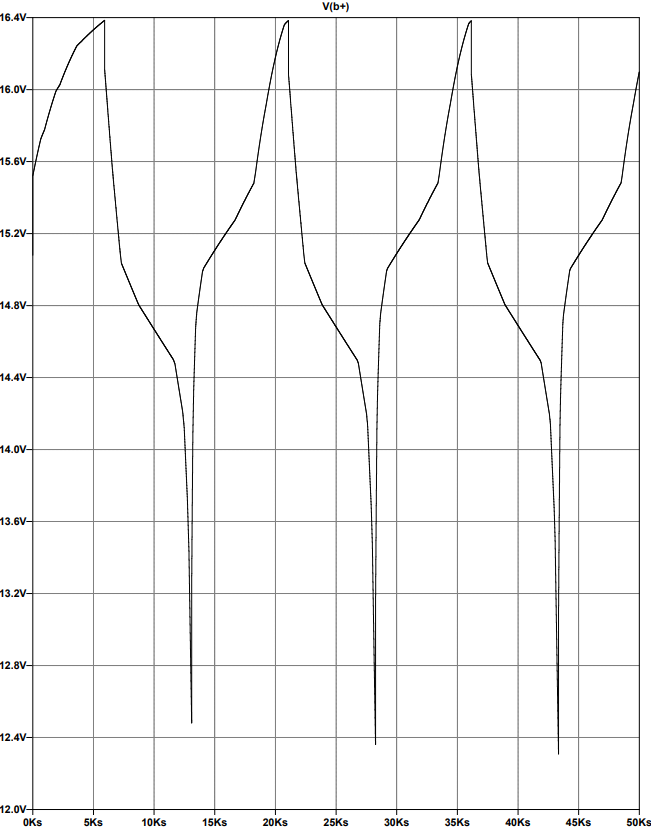

# 4-Cell Lithium-Ion BMS

LTspice simulation of a 4-cell lithium-ion battery management system.

## Features

* 4-cell series battery model
* SOC estimation using coulomb counting
* OCV lookup tables and cell internal resistance
* Passive cell balancing
* Overvoltage and undervoltage protection
* Charge and discharge control

## Files

* `BMS_4Cell_LithiumIon.asc` — LTspice schematic
  
## Schematic

Complete BMS schematic showing the cell models, protection logic, passive balancing, and charge/discharge control.

## Simulation Results

Charge and discharge simulation showing the battery pack completing a full charge/discharge cycle.

## Tools

* LTspice
